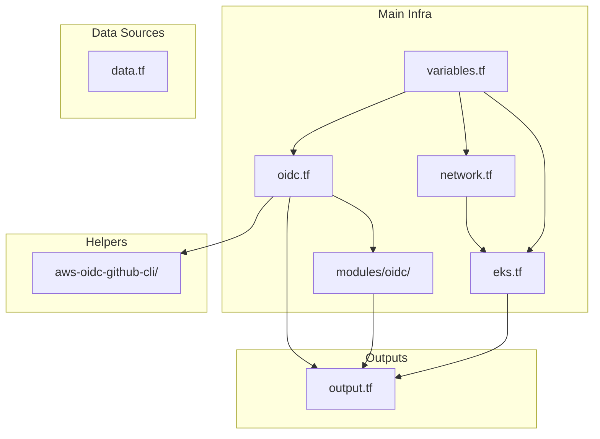

# Infra-Code-Explaination.md

## Overview

This document explains the structure, relationships, and purpose of each Terraform file and module in the `infra` directory for the 3-tier EKS project. It will help you quickly understand how the infrastructure code is organized and how the different components interact.

---

## Directory Structure

```
infra/
├── aws-oidc-github-cli/      # Helper scripts and policies for OIDC/GitHub integration
├── modules/                  # Custom reusable Terraform modules
│   └── oidc/                 # OIDC/IAM role module for GitHub Actions
├── data.tf                   # Data sources (availability zones, region, caller identity)
├── eks.tf                    # EKS cluster and node group definition
├── network.tf                # VPC, subnets, and networking resources using eks_network module
├── oidc.tf                   # OIDC/IAM role for GitHub Actions
├── output.tf                 # Outputs (e.g., IAM role ARN)
├── variables.tf              # Variable definitions
└── terraform.tfvars          # Variable values
```

---

## File-by-File Explanation

### 1. **variables.tf**
- **Purpose:** Declares all input variables used throughout the Terraform code.
- **Contents:** AWS region, project/environment names, GitHub repo info, DB settings, resource name prefixes, etc.
- **Usage:** All other files reference these variables for consistency and reusability.

---

### 2. **data.tf**
- **Purpose:** Defines data sources to fetch dynamic AWS information.
- **Contents:**
  - `aws_availability_zones`: Gets available AZs in the region.
  - `aws_region`: Gets the current AWS region.
  - `aws_caller_identity`: Gets the current AWS account info.
- **Usage:** Used for dynamic resource placement and outputs.

---

### 3. **network.tf**
- **Purpose:** Provisions the VPC, public/private subnets, NAT gateway, and DNS support.
- **Contents:**
  - Uses the public Terraform AWS VPC module (`terraform-aws-modules/vpc/aws`) as `eks_network`.
  - Defines VPC CIDR, subnets, NAT gateway, DNS settings.
- **Workflow:** The resulting VPC and subnets are referenced by the EKS module.

---

### 4. **eks.tf**
- **Purpose:** Provisions the EKS cluster and managed node groups.
- **Contents:**
  - Uses the public Terraform AWS EKS module.
  - Sets cluster name, version, endpoint access, and admin permissions.
  - References VPC and private subnets from `network.tf`.
  - Defines managed node group(s) with instance types and scaling settings.
  - Adds tags for environment and repo.
- **Workflow:** Depends on the VPC/subnets from `network.tf`.

---

### 5. **oidc.tf**
- **Purpose:** Sets up IAM roles and policies for GitHub Actions to deploy to EKS using OIDC.
- **Contents:**
  - Defines a local variable for the EKS/ECR access policy (JSON).
  - Defines common tags.
  - Calls the local `modules/oidc` module to create the IAM role and policy for GitHub Actions.
- **Workflow:** Enables secure CI/CD by allowing GitHub Actions to assume a role in AWS.

---

### 6. **output.tf**
- **Purpose:** Exposes important outputs from the Terraform run.
- **Contents:** Outputs the IAM role ARN created for GitHub Actions (from the OIDC module).

---

### 7. **terraform.tfvars**
- **Purpose:** Provides values for variables defined in `variables.tf`.
- **Contents:** (Not shown here, but typically includes environment, prefix, DB settings, etc.)

---

### 8. **modules/oidc/**
- **Purpose:** Local module to create IAM roles and policies for OIDC integration (used by `oidc.tf`).
- **Contents:** 
  - `main.tf`: Logic for creating IAM role, policy, and trust relationship.
  - `variables.tf`: Input variables for the module.
  - `output.tf`: Outputs (e.g., role ARN).

---

### 9. **aws-oidc-github-cli/**
- **Purpose:** Contains helper scripts and policy documents for manually configuring OIDC/GitHub integration.
- **Contents:**
  - `configure-oidc-github.sh`: Bash script to create OIDC provider, IAM role, and policy for GitHub Actions.
  - `eks-policy.json`, `trust-policy.json`: Policy documents for the IAM role.
  - `rbac.yaml`: (Empty) Placeholder for Kubernetes RBAC if needed.

---

## **Workflow Diagram**



---

## **Summary Table**

| File                      | Purpose                                                                           | Relationships                                 |
|---------------------------|-----------------------------------------------------------------------------------|----------------------------------------------|
| network.tf                | Provisions VPC, subnets, NAT, DNS using eks_network module                        | Used by eks.tf                                |
| eks.tf                    | Provisions EKS cluster and node groups                                            | Depends on network.tf                         |
| oidc.tf                   | Sets up IAM role/policy for GitHub Actions OIDC                                   | Uses modules/oidc, variables.tf               |
| variables.tf              | Defines variables used throughout the configuration                               | Used by all other .tf files                   |
| terraform.tfvars          | Variable values (not shown)                                                       | Used by Terraform at runtime                  |

---

## **How to Read This Directory**

- **Start with `variables.tf`** to see what parameters you can/should set.
- **Check `network.tf`** for VPC/subnet structure using the eks_network module.
- **Look at `eks.tf`** for EKS cluster/node group setup.
- **See `oidc.tf` and `modules/oidc/`** for CI/CD IAM/OIDC integration.
- **Use `output.tf`** to find important outputs after `terraform apply`.
- **Refer to `aws-oidc-github-cli/`** for manual OIDC setup or troubleshooting.

---

## Troubleshooting: AWS Provider Version Constraint Error

### Issue: Failed to Query Available Provider Packages (AWS Provider Version Constraints)

**Error Message:**
```
│ Error: Failed to query available provider packages
│ 
│ Could not retrieve the list of available versions for provider hashicorp/aws: no available releases
│ match the given constraints >= 4.33.0, >= 5.95.0, >= 6.0.0, < 6.0.0
```

**Root Cause:**
This error occurs because the required AWS provider version constraints are contradictory. The modules (EKS, VPC, etc.) require AWS provider version `>= 5.95.0, < 6.0.0`, but another constraint (possibly from a previous configuration or another module) is requiring `>= 6.0.0`, which is incompatible. No AWS provider version can satisfy both `>= 6.0.0` and `< 6.0.0` at the same time.

**Solution:**
Pin the AWS provider version in your root Terraform configuration to a compatible range. Add or update a `providers.tf` file in your infra directory with the following content:

```hcl
terraform {
  required_providers {
    aws = {
      source  = "hashicorp/aws"
      version = ">= 5.95.0, < 6.0.0"
    }
    # Add other providers as needed
  }
}
```

Then run:
```bash
terraform init -upgrade
```

This will ensure Terraform uses a compatible AWS provider version and resolves the error.

**What Was Fixed:**
- File: `infra/providers.tf` (created or updated)
- Added a `required_providers` block to pin the AWS provider version.

---

## Troubleshooting: VPC Module and AWS Provider Version Conflict

### Issue: Provider Version Conflict Between VPC and EKS Modules

**Error Message:**
```
│ Error: Failed to query available provider packages
│ 
│ Could not retrieve the list of available versions for provider hashicorp/aws: no available releases
│ match the given constraints >= 4.33.0, >= 5.95.0, >= 6.0.0, < 6.0.0
```

**Root Cause:**
- The VPC module (`terraform-aws-modules/vpc/aws`) was set to version 6.x, which requires AWS provider `>= 6.0.0`.
- The EKS and other modules require AWS provider `< 6.0.0`.
- No AWS provider version can satisfy both constraints, resulting in a version conflict.

**Solution:**
- Downgrade the VPC module to a 5.x version that is compatible with AWS provider `< 6.0.0`.
- The recommended version is `5.8.1` (the latest 5.x release).

**How to Fix:**
1. Edit your `network.tf` and set the VPC module version:
   ```hcl
   module "eks_network" {
     source  = "terraform-aws-modules/vpc/aws"
     version = "5.8.1"
     # ... rest of your config ...
   }
   ```
2. Save the file.
3. Delete the lock file and re-initialize Terraform:
   ```bash
   rm -f .terraform.lock.hcl
   terraform init -upgrade
   ```

**What Was Fixed:**
- File: `infra/network.tf`
- Change: Added `version = "5.8.1"` to the VPC module block.

This ensures all modules use a compatible AWS provider version and resolves the conflict.

--- 
