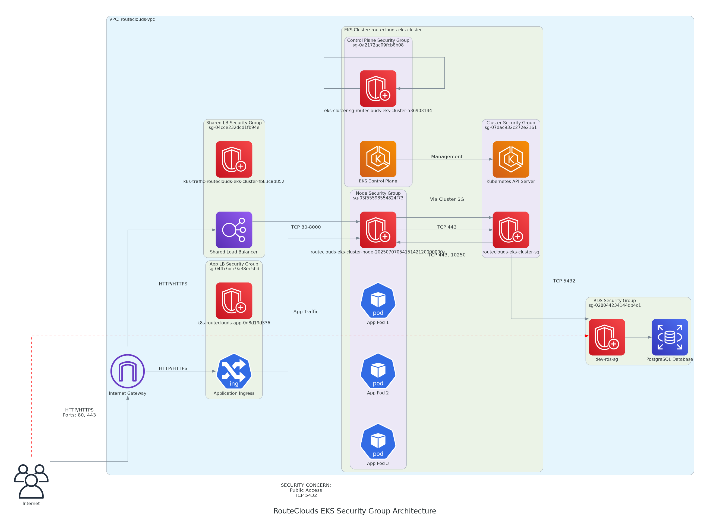
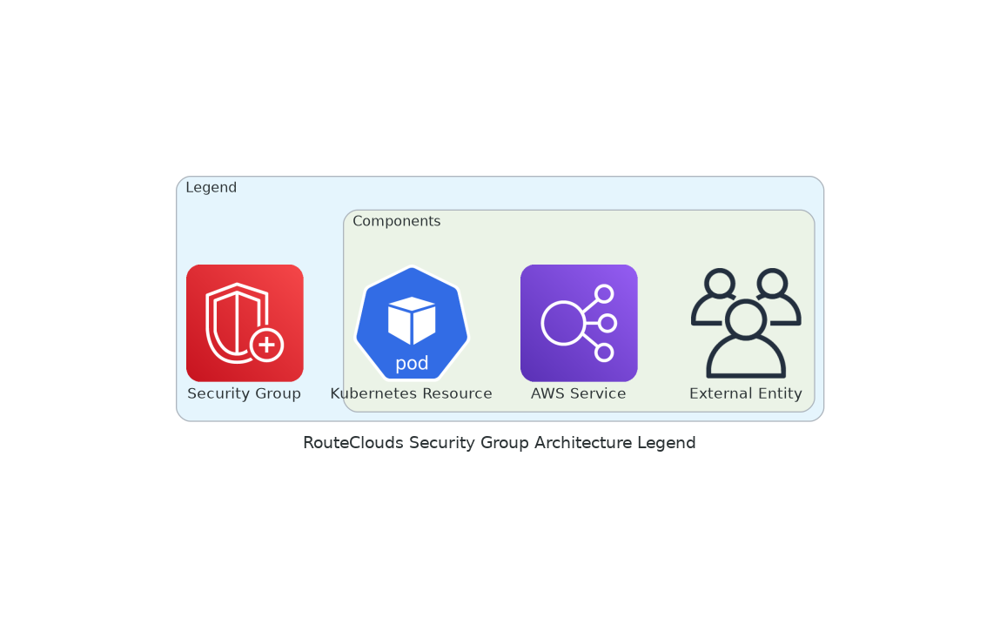

# RouteClouds Security Groups Details





# RouteClouds E-Commerce Platform: Security Groups Architecture

## Overview

Security groups in AWS act as virtual firewalls, controlling inbound and outbound traffic at the resource (instance or ENI) level. In the RouteClouds 3-tier EKS deployment, security groups are carefully designed to:
- Isolate application tiers (frontend, backend, database)
- Allow only necessary communication between components
- Protect sensitive resources (e.g., RDS database)

This document explains the security group architecture, traffic flows, best practices, and recommendations for the RouteClouds platform.

---

## Key Security Groups in the Architecture

### 1. Cluster Security Group (`sg-07dac932c272e2161`)
- **Name:** routeclouds-eks-cluster-sg
- **Purpose:** Controls access to the Kubernetes API server (control plane)
- **Inbound:**
  - TCP 443 from node security group (`sg-03f55598554824f73`) (API server communication)
  - TCP 443 from admin IPs (kubectl access)
- **Outbound:**
  - TCP 443, 10250 to node security group (kubelet communication)
  - TCP 4443/9443 to nodes (webhook communication)
- **Referenced by:** Node SG, RDS SG

### 2. Node Security Group (`sg-03f55598554824f73`)
- **Name:** routeclouds-eks-cluster-node-2025070705415142120000000a
- **Purpose:** Controls communication between EKS worker nodes and allows pods to communicate
- **Inbound:**
  - **Rule sgr-0b08d02da1b2ff9bf:** TCP 80-8000 from load balancer SG (`sg-04cce232dcd1fb94e`) (for ALB traffic)
  - **Rule sgr-0455838591020b9c3:** UDP 53 from itself (CoreDNS pod-to-pod DNS)
  - **Rule sgr-0b0301c546a25389e:** TCP 1025-65535 from itself (ephemeral ports for pod-to-pod communication)
  - TCP 6443, 8443, 9443, 10250, 443, 4443 from cluster SG (Kubernetes control plane communication)
- **Outbound:**
  - ALL traffic to any destination (0.0.0.0/0) (external resources, image pulls)
- **References:** Cluster SG (API server access)
- **Referenced by:** Cluster SG (kubelet communication)

#### Self-Referencing Rules in Node SG
- **UDP 53:** Allows DNS resolution between pods on different nodes (CoreDNS)
- **TCP 1025-65535:** Allows dynamic pod-to-pod communication (Kubernetes networking)
- **TCP 53:** DNS over TCP for large DNS responses

### 3. RDS Security Group (`sg-028044234144db4c1`)
- **Name:** dev-rds-sg
- **Purpose:** Controls access to the PostgreSQL database
- **Inbound:**
  - **Rule sgr-01f83a094f4d1cb5b:** TCP 5432 from 0.0.0.0/0 (**Critical Security Risk: public DB access**)
  - TCP 5432 from cluster SG (`sg-07dac932c272e2161`) (intended secure access)
- **Outbound:**
  - ALL traffic to any destination (0.0.0.0/0)
- **Referenced by:** Cluster SG

### 4. Load Balancer Security Groups
#### 4.1 Shared Load Balancer SG (`sg-04cce232dcd1fb94e`)
- **Name:** k8s-traffic-routeclouds-eks-cluster-fb83cad852
- **Purpose:** Shared backend SG for Kubernetes-managed load balancers
- **Inbound:** No specific rules (frontend SGs define ingress)
- **Outbound:** ALL traffic to any destination (0.0.0.0/0)
- **Referenced by:** Node SG (for ALB traffic)

#### 4.2 Application-Specific Load Balancer SG (`sg-04fb7bcc9a38ec5bd`)
- **Name:** k8s-routeclouds-app-0d8d19d336
- **Purpose:** Application-specific load balancer
- **Why two LB SGs?** Shared for multiple services, app-specific for granular control

### 5. EKS Control Plane Security Group (`sg-0a2172ac09fcb8b08`)
- **Name:** eks-cluster-sg-routeclouds-eks-cluster-536903144
- **Purpose:** Controls traffic to/from EKS control plane
- **Inbound:** ALL protocols from itself (EFA traffic)
- **Outbound:** ALL traffic to any destination (0.0.0.0/0)

---

## Security Group Relationships & Traffic Flow

```
Internet ↔ Load Balancer SGs (sg-04cce232dcd1fb94e, sg-04fb7bcc9a38ec5bd) ↔ Node SG (sg-03f55598554824f73) ↔ Cluster SG (sg-07dac932c272e2161) ↔ RDS SG (sg-028044234144db4c1)
                                                                      ↑
                                                                      ↓
                                                      Control Plane SG (sg-0a2172ac09fcb8b08)
```

**Examples:**
- User → ALB (80/443) → Node (3000/8000) → App Pod
- App Pod → Node SG → RDS SG (5432) → Database
- Node SG ↔ Cluster SG (443, 10250) for Kubernetes control
- Node → Node SG (self-referencing) → Node (CoreDNS, ephemeral ports)

---

## Rule-by-Rule Analysis & Explanations
- **Node SG Rule sgr-0b08d02da1b2ff9bf:**
  - TCP 80-8000 from LB SG, created by AWS Load Balancer Controller for pod traffic
- **Node SG Rule sgr-0455838591020b9c3:**
  - UDP 53 from itself, for CoreDNS pod-to-pod DNS
- **Node SG Rule sgr-0b0301c546a25389e:**
  - TCP 1025-65535 from itself, for ephemeral pod-to-pod communication
- **RDS SG Rule sgr-01f83a094f4d1cb5b:**
  - TCP 5432 from 0.0.0.0/0, public DB access (should be removed)

---

## Load Balancer Controller Rules & Dual SGs
- **Shared LB SG:** Used for multiple services/ingresses, managed by AWS Load Balancer Controller
- **App-Specific LB SG:** Created for the 3-tier app, allows granular traffic control
- **Controller automatically manages rules** based on Kubernetes Service/Ingress resources

---

## Security Implications & Remediation Steps
- **Public Database Access (Critical):**
  - The RDS SG allows inbound 5432 from 0.0.0.0/0, exposing the DB to the internet
  - **Remediation:** Remove this rule, allow only from cluster/node SGs, use bastion host for admin
- **Overly Permissive Outbound Rules:**
  - Most SGs allow all outbound traffic; restrict to only required destinations/ports
- **Wide Port Ranges:**
  - Node SG allows 80-8000, 1025-65535; audit and narrow if possible
- **Compliance:**
  - Public DB access may violate PCI DSS, HIPAA, etc.
- **Monitoring:**
  - Enable RDS enhanced monitoring, audit logging, and VPC flow logs

---

## Best Practices Implementation
- **Security Group References:** Used instead of CIDR blocks for dynamic, secure access
- **Layered Security:** Different SGs for each component/tier
- **Principle of Least Privilege:** Restrict inbound/outbound to only what is needed
- **Automation:** AWS Load Balancer Controller manages LB rules
- **Regular Audits:** Review SG rules for compliance and least privilege

---

## Troubleshooting Security Group Issues
- **Connection Timeouts:** Check for missing inbound rules
- **Connection Refused:** Ensure the application is running and listening
- **Intermittent Connectivity:** Check health check ports and pod readiness
- **Debugging:**
  - Use `nc` (netcat) or `telnet` from within pods to test connectivity
  - Enable VPC flow logs for traffic analysis

---

## Visual Summary


---

## Conclusion

The RouteClouds security group architecture follows AWS and Kubernetes best practices:
- Uses security group references for dynamic, secure access
- Implements layered security and least privilege
- Leverages automation for load balancer management

**Areas for improvement:**
- Remove public DB access (0.0.0.0/0 on 5432)
- Restrict outbound rules and wide port ranges
- Regularly audit and monitor all SG rules

By following these recommendations, the platform will maintain a strong security posture while supporting scalable, reliable application delivery.

---

## References
- [AWS EKS Security Groups Documentation](https://docs.aws.amazon.com/eks/latest/userguide/sec-group-reqs.html)
- Project Terraform code: `Project-1-Code/infra/`
- Security group analysis scripts: `Subnet-Concept/SG-script.sh`

This document provides a complete, project-specific, and audit-ready explanation of the security group architecture for RouteClouds. For further details, consult the referenced diagrams and scripts. 