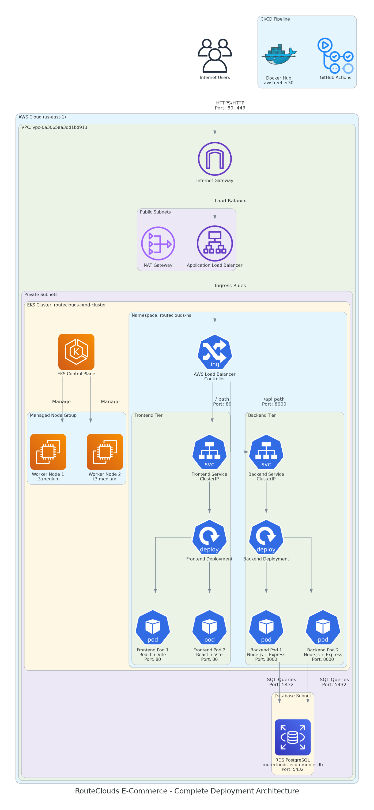

# RouteClouds E-Commerce Platform on AWS EKS



A comprehensive DevOps project demonstrating the deployment of a production-ready RouteClouds E-Commerce application on AWS EKS with complete CI/CD pipeline, Docker Hub integration, and real-world infrastructure setup including EKS, RDS, ALB, Route53, OIDC, IAM, and EC2.

## 🏗️ Project Overview

This project showcases modern cloud-native development and deployment practices by implementing a complete 3-tier e-commerce application architecture:

- **Frontend Tier**: React.js application with Vite and modern UI/UX
- **Backend Tier**: Node.js/Express.js REST API with TypeScript
- **Database Tier**: AWS RDS PostgreSQL with private networking
- **Infrastructure**: AWS EKS cluster with managed node groups
- **Load Balancing**: AWS Application Load Balancer (ALB)
- **Networking**: VPC with public/private subnets and security groups
- **CI/CD**: GitHub Actions with Docker Hub integration

### 🎯 Application Purpose

The **RouteClouds E-Commerce Platform** is a modern, full-featured e-commerce application designed for cloud infrastructure services:
- Product catalog management with categories and detailed product information
- User authentication and authorization system
- Shopping cart functionality with real-time updates
- Order management and processing
- Admin dashboard for product and category management
- Responsive design optimized for desktop usage

## 🛠️ Technology Stack

### Frontend
- **Framework**: React.js 18.2.0
- **Styling**: TailwindCSS with modern UI components
- **Build Tool**: Vite (fast build and development)
- **Web Server**: Nginx (Alpine)
- **Container Port**: 80
- **Environment**: VITE_API_URL for API communication

### Backend
- **Framework**: Node.js with Express.js
- **Language**: TypeScript for type safety
- **Database Client**: PostgreSQL client with connection pooling
- **Authentication**: JWT-based user authentication
- **Container Port**: 8000
- **API Endpoints**: RESTful API with comprehensive e-commerce features

### Database
- **Engine**: PostgreSQL 14.x
- **Instance Type**: AWS RDS db.t3.micro
- **Storage**: 30GB GP3 with auto-scaling
- **Database Name**: routeclouds_ecommerce_db
- **User**: routeclouds_user
- **Networking**: Private subnets only

### Infrastructure
- **Container Orchestration**: AWS EKS 1.31
- **Compute**: EC2 t3.medium instances (managed node groups)
- **Load Balancer**: AWS Application Load Balancer
- **DNS**: AWS Route53 (optional)
- **Infrastructure as Code**: Terraform
- **CI/CD**: GitHub Actions with Docker Hub integration
- **Container Registry**: Docker Hub (awsfreetier30 account)

## 📁 Project Structure

```
Project-1-RouteClouds-E-commerce-App/
├── Project-1-Code/
│   ├── backend/                  # Node.js + Express API
│   ├── frontend/                # React + Vite application
│   ├── k8s/                     # Kubernetes manifests
│   ├── infra/                   # Terraform infrastructure code
│   ├── docker-compose.yml       # Local development
│   └── ...
├── Project-1-Documentation/
│   ├── README.md
│   ├── Security-Groups-Details/
│   │   └── RouteClouds-Security-Groups-Details.md
│   ├── Terraform-Code-Explaination/
│   │   └── Terraform-Infra-Code-Explaination.md
│   ├── migration-job-troubleshooting.md
│   └── ... (other documentation files and folders)
├── Images/
│   ├── routeclouds_deployment_architecture.png
│   ├── routeclouds_security_group_architecture.png
│   ├── routeclouds_sg_architecture_legend.png
│   └── routeclouds_terraform_infra_code_workflow_(step-by-step).png
└── ...
```

## 🚀 Quick Start

### Prerequisites

Ensure you have the following tools installed:

- [AWS CLI](https://aws.amazon.com/cli/) (configured with appropriate permissions)
- [kubectl](https://kubernetes.io/docs/tasks/tools/)
- [eksctl](https://eksctl.io/)
- [Terraform](https://www.terraform.io/) (>= 1.0)
- [Helm](https://helm.sh/)
- [Docker](https://www.docker.com/)
- [Git](https://git-scm.com/)

### Local Development Setup

1. **Clone the repository**:
   ```bash
   git clone https://github.com/aidevops2025/Project-1-RouteClouds-E-commerce-App.git
   cd Project-1-RouteClouds-E-commerce-App
   ```

2. **Start local development environment**:
   ```bash
   # For development with local builds
   docker-compose up --build

   # For production testing with Docker Hub images
   docker-compose -f docker-compose.prod.yml up -d
   ```

3. **Initialize database** (first-time setup):
   ```bash
   # Database is automatically initialized with sample data
   # Check backend logs for initialization status
   docker-compose logs backend
   ```

4. **Access the application**:
   - Frontend: http://localhost:3000
   - Backend API: http://localhost:8000/api/hello
   - Database: localhost:5432
   - Login Page: http://localhost:3000/login

### Production Deployment

For complete production deployment instructions, refer to:
- **[4.RouteClouds-Application-Deployment.md](Project-1-Documentation/4.RouteClouds-Application-Deployment.md)** - Complete deployment guide

## 📚 Documentation

### Core Documentation

- **[1.RouteClouds-Complete-Project-Guide.md](Project-1-Documentation/1.RouteClouds-Complete-Project-Guide.md)**
- **[2.RouteClouds-App-Details.md](Project-1-Documentation/2.RouteClouds-App-Details.md)**
- **[3.Building-Docker-Image-Process-RouteClouds-Project.md](Project-1-Documentation/3.Building-Docker-Image-Process-RouteClouds-Project.md)**
- **[4.RouteClouds-Application-Deployment.md](Project-1-Documentation/4.RouteClouds-Application-Deployment.md)**
- **[5.RouteClouds-Project-Deletion-Process.md](Project-1-Documentation/5.RouteClouds-Project-Deletion-Process.md)**
- **[6.RouteClouds-Application-Troubleshooting-Guide.md](Project-1-Documentation/6.RouteClouds-Application-Troubleshooting-Guide.md)**
- **[7.RouteClouds-Core-Concepts.md](Project-1-Documentation/7.RouteClouds-Core-Concepts.md)**
- **[Security-Groups-Details/RouteClouds-Security-Groups-Details.md](Project-1-Documentation/Security-Groups-Details/RouteClouds-Security-Groups-Details.md)**
- **[Terraform-Code-Explaination/Terraform-Infra-Code-Explaination.md](Project-1-Documentation/Terraform-Code-Explaination/Terraform-Infra-Code-Explaination.md)**
- **[migration-job-troubleshooting.md](Project-1-Documentation/migration-job-troubleshooting.md)**

### Specialized Documentation

- **[Security-Groups-Details/RouteClouds-Security-Groups-Details.md](Project-1-Documentation/Security-Groups-Details/RouteClouds-Security-Groups-Details.md)**
- **[Terraform-Code-Explaination/Terraform-Infra-Code-Explaination.md](Project-1-Documentation/Terraform-Code-Explaination/Terraform-Infra-Code-Explaination.md)**
- **[migration-job-troubleshooting.md](Project-1-Documentation/migration-job-troubleshooting.md)**

## 🏛️ Architecture

### High-Level Architecture

```
Internet → Route53 → ALB → EKS Cluster → RDS PostgreSQL
                      ↓
                  Frontend Pods ← → Backend Pods
                      ↓                ↓
                  Nginx Service    Express.js Service
                      ↓                ↓
                  Docker Hub      Docker Hub
                (awsfreetier30)  (awsfreetier30)
```

### Detailed Component Flow

```
┌─────────────────┐    ┌─────────────────┐    ┌─────────────────┐
│   Frontend      │    │    Backend      │    │    Database     │
│ (React + Vite)  │◄──►│(Node.js + TS)   │◄──►│  (PostgreSQL)   │
│   Port: 80      │    │   Port: 8000    │    │   Port: 5432    │
│   2 Replicas    │    │   2 Replicas    │    │   RDS Instance  │
│ Health: /login  │    │Health: /api/hello│    │routeclouds_db   │
└─────────────────┘    └─────────────────┘    └─────────────────┘
         ▲                       ▲                       ▲
         │                       │                       │
    ┌─────────┐            ┌─────────┐            ┌─────────┐
    │ ClusterIP│            │ClusterIP│            │External │
    │ Service │            │ Service │            │ Service │
    └─────────┘            └─────────┘            └─────────┘
         ▲                       ▲
         │                       │
    ┌──────────────────────────────┐
    │     ALB Ingress Controller   │
    │    Health Check: /login      │
    └──────────────────────────────┘
                   ▲
    ┌──────────────────────────────┐
    │   Application Load Balancer  │
    │   Routes: / → Frontend       │
    │          /api → Backend      │
    └──────────────────────────────┘
                   ▲
    ┌──────────────────────────────┐
    │      GitHub Actions CI/CD    │
    │   Auto-build → Docker Hub    │
    │   Auto-deploy → EKS          │
    └──────────────────────────────┘
```

## 🔧 Key Features

### Infrastructure Features
- **Infrastructure as Code**: Complete Terraform configuration
- **Container Orchestration**: Kubernetes deployment on AWS EKS
- **Auto Scaling**: Horizontal Pod Autoscaler (HPA) configuration
- **Load Balancing**: AWS ALB with health checks
- **Security**: VPC with private subnets, security groups, IAM roles
- **Monitoring**: CloudWatch integration and optional Prometheus/Grafana

### Application Features
- **Modern E-Commerce UI**: React frontend with Vite and TailwindCSS
- **RESTful API**: Node.js/Express backend with TypeScript
- **E-Commerce Functionality**: Product catalog, shopping cart, user authentication
- **Database Management**: PostgreSQL with automated initialization
- **Health Checks**: Liveness and readiness probes for both tiers
- **Configuration Management**: Kubernetes ConfigMaps and Secrets
- **Rolling Updates**: Zero-downtime deployment strategy

### DevOps Features
- **Complete CI/CD**: GitHub Actions with Docker Hub integration
- **Automated Builds**: Trigger on code push with automatic image tagging
- **Container Registry**: Docker Hub with versioned images
- **Container Security**: Multi-stage builds, non-root users
- **Backup Strategy**: RDS automated backups
- **Disaster Recovery**: Multi-AZ deployment options
- **Cost Optimization**: Resource limits and efficient scaling
- **Rollback Capability**: Automatic rollback on deployment failure

## 🔐 Security Considerations

- **Network Security**: Private subnets for database, security groups with minimal access
- **Container Security**: Non-root user execution, minimal base images
- **Data Security**: Kubernetes secrets, optional AWS Secrets Manager integration
- **Access Control**: IAM roles and policies, RBAC for Kubernetes
- **Encryption**: TLS for external traffic, encryption at rest for RDS

## 📊 Monitoring and Observability

- **Health Checks**: Application and database health endpoints
- **Metrics**: CloudWatch metrics for EKS and RDS
- **Logging**: Centralized logging with CloudWatch Logs
- **Alerting**: CloudWatch alarms for critical metrics
- **Optional**: Prometheus and Grafana for advanced monitoring

## 🧪 Testing

### Local Testing
```bash
# Backend API testing
curl http://localhost:8000/api/hello
curl http://localhost:8000/api/categories
curl http://localhost:8000/api/products
curl http://localhost:8000/api/db-test

# Frontend testing
npm run test  # If tests are available
curl -I http://localhost:3000/login

# Database connectivity
docker-compose logs backend | grep "Database"
```

### Production Testing
```bash
# Health checks
kubectl get pods -n routeclouds-ns
kubectl logs -n routeclouds-ns -l app=backend
kubectl logs -n routeclouds-ns -l app=frontend

# End-to-end testing
curl https://your-domain.com/api/hello
curl https://your-domain.com/login
```

## 🚨 Troubleshooting

For comprehensive troubleshooting guidance, refer to:
- **[migration-job-troubleshooting.md](Project-1-Documentation/migration-job-troubleshooting.md)**

Common issues:
- **Pod startup failures**: Check resource limits and image availability
- **Database connectivity**: Verify security groups and DNS resolution
- **Load balancer issues**: Ensure proper subnet tagging for ALB
- **Ingress problems**: Check ALB controller logs and IngressClass configuration

## 🧹 Cleanup

To safely delete all resources and avoid charges:

1. **Follow the systematic deletion process**:
   - Refer to **[RouteClouds-Project-Deletion-Process.md](Project-1-Documentation/RouteClouds-Project-Deletion-Process.md)**

2. **Quick cleanup** (use with caution):
   ```bash
   # Delete Kubernetes resources
   kubectl delete namespace routeclouds-ns
   
   # Destroy infrastructure
   cd Project-1-Code/infra/
   terraform destroy -auto-approve
   ```

## 🤝 Contributing

1. Fork the repository
2. Create a feature branch (`git checkout -b feature/amazing-feature`)
3. Commit your changes (`git commit -m 'Add some amazing feature'`)
4. Push to the branch (`git push origin feature/amazing-feature`)
5. Open a Pull Request

## 📄 License

This project is licensed under the MIT License - see the [LICENSE](LICENSE) file for details.

## 🛠️ Author & Community

This project is crafted by [**RouteClouds**](https://routeclouds.com).

### 📧 Connect with me:

[](https://linkedin.com/in/harshhaa-vardhan-reddy) 
[](https://github.com/NotHarshhaa) 
[](https://t.me/prodevopsguy) 
[](https://dev.to/notharshhaa) 
[](https://hashnode.com/@prodevopsguy)

---

## 🌟 Acknowledgments

- AWS for providing excellent cloud services and documentation
- Kubernetes community for the robust orchestration platform
- React and Flask communities for the amazing frameworks
- All contributors and users of this project

---

**⭐ If you find this project helpful, please give it a star!**
